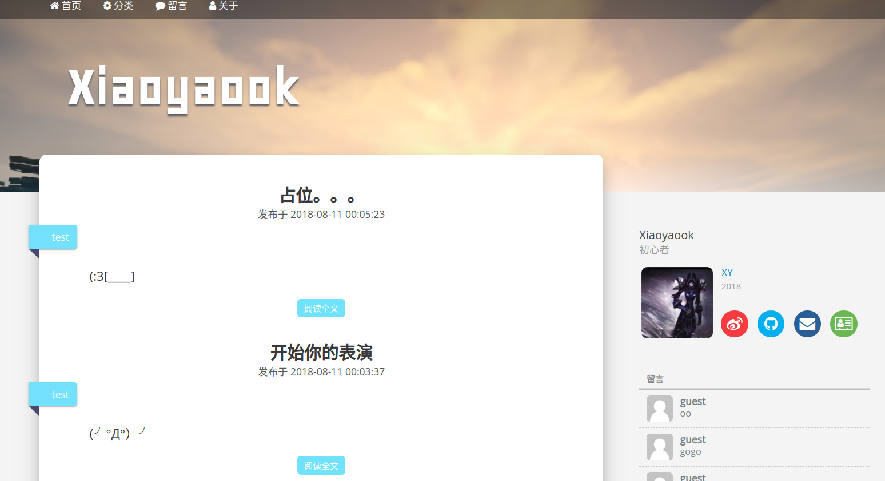
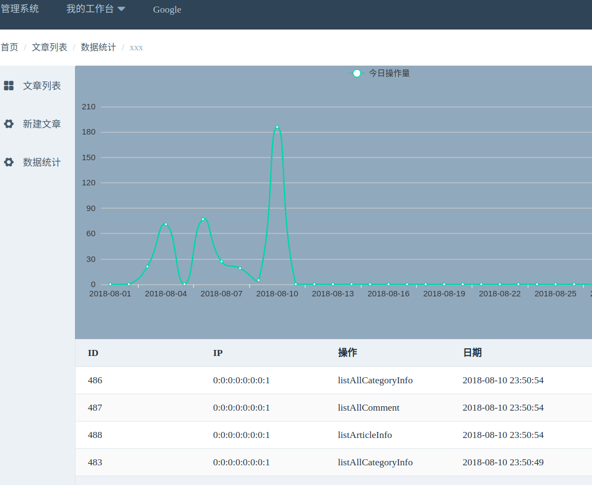
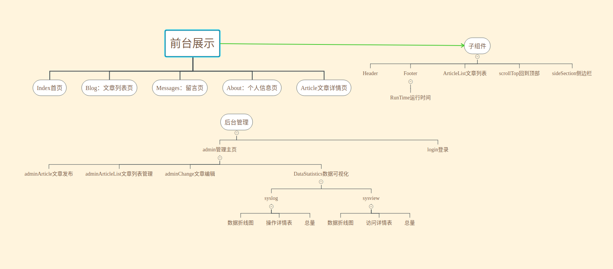

# blog

项目技术：Vue + Vue-router + Axios + Element-UI + mavon-editor + v-charts

博客首页：


数据可视化：


需求分析：



在http包中对Axios二次封装。

文章代码高亮，通过引入highlight.js依赖实现，同时我们将其封装成自定义指令：
```vue
import hljs from 'highlight.js';
Vue.directive('hljs', el => {
  let blocks = el.querySelectorAll('pre code');
  Array.prototype.forEach.call(blocks, hljs.highlightBlock);
});
```
在需要进行代码高亮的地方，加上 v-hljs 即可:

`<div class="post-content wysiwyg" v-html="article.content" v-hljs>`

此时要注意，highlight.js已经渲染完毕，但我们还需要注入css，才能显示出高亮的效果，如：

`import 'highlight.js/styles/atelier-forest-light.css'`

代码样式的css可在[highlight.js/src/styles/](https://github.com/highlightjs/highlight.js/tree/master/src/styles)找到

9-24 修改新建分类后，不刷新，添加文章失败的bug
